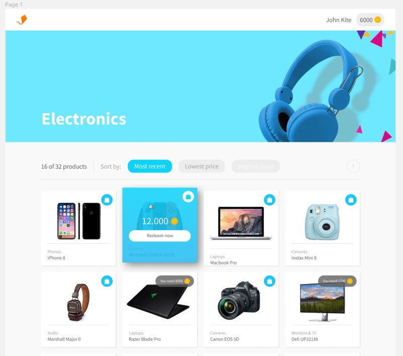
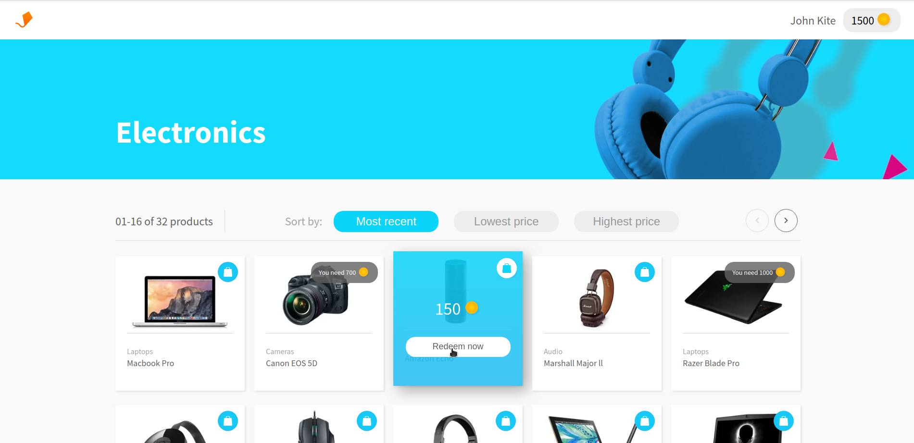
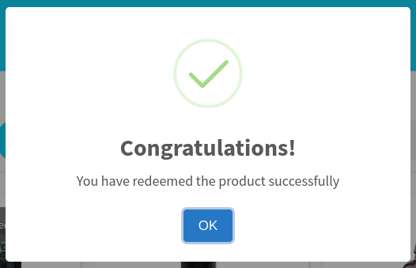
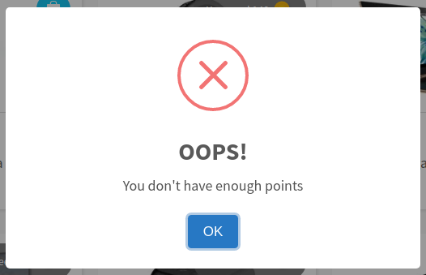
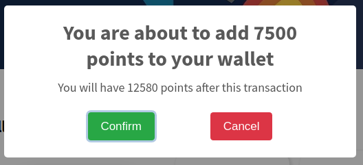
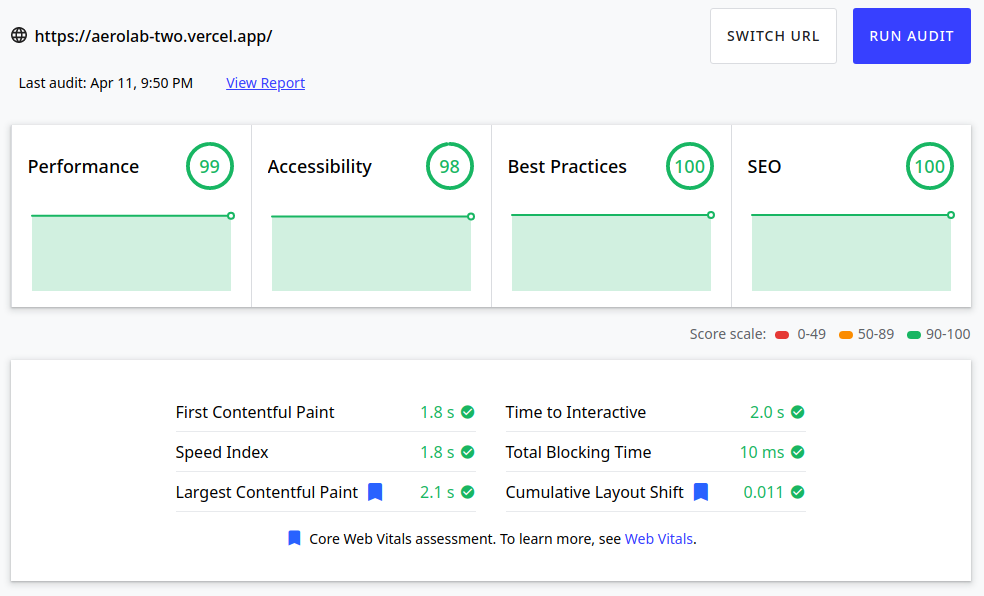

# Challenge de Aerolab

- Consigna: [Ir a la consigna](https://aerolab.co/coding-challenge-instructions)

- API: [Ir a la documentación de la API](https://aerolabchallenge.docs.apiary.io/)

- Deploy: [Ir al deploy](https://aerolab-two.vercel.app/)

## Solución

---

Mi solución está basada 100% en el diseño propuesto.

### Diseño original:

### Mi solución:

### Layout:

Uso flexbox y grid combinados para crear un layout responsive que no dependa tanto de media queries.

### Paginado:

El paginado se maneja con un custom hook que toma el total de items y la cantidad de items por página que se quieren mostrar, y devuelve un objeto con pagina actual, el primer y último item del array de items, si la página siguiente y la página anterior están disponibles (eso se pasa como prop a los botones siguiente y anterior para desactivarlos según corresponda), también devuelve la información para que se le muestre al usuario qué items está viendo, y cuál es el total, esa información se muestra en el componente ItemIndex.

### Alertas y notificaciones:

Las alertas y notificaciones se manejan con [sweetalert2](https://sweetalert2.github.io/):

La notificación para canjear el producto siempre usa el artículo apropiado según el nombre del producto:

> You are about to redeem 2200 points for **a** Canon EOS 5D

> You are about to redeem 150 points for **an** Amazon Echo

### Performance

Uso el componente [Images](https://nextjs.org/docs/api-reference/next/image) de [NextJS](https://nextjs.org) para optimizar la carga de imágenes.

Utilizo 2 context, uno con la información del usuario y otro con la de los productos. Esto no sólo evita que vuelva a hacer un fetch de la información cada vez que se cambia de página, sino que también hace más claro el código evitando el prop drilling.
